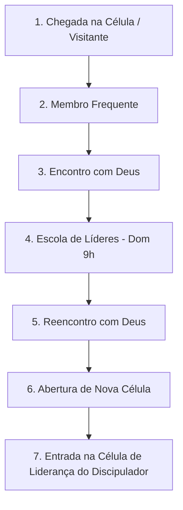

# 🌊 Especificação Completa do Sistema de Gestão de Células — Comunidade Cristã Wave

> **Versão:** 1.0  
> **Igreja:** Comunidade Cristã Wave  
> **Liderança Principal:** Pastores Rafa e Flávia  
> **Objetivo:** Documentar a arquitetura, regras de negócio, jornada espiritual e modelagem técnica do sistema de gestão de células da Wave.

---

## 📋 Sumário
1. [Visão Geral e Princípios Fundamentais](#1-visão-geral-e-princípios-fundamentais)
2. [Estrutura da Igreja & Regras de Negócio](#2-estrutura-da-igreja--regras-de-negócio)
3. [Jornada de Formação Espiritual (Trilha Wave)](#3-jornada-de-formação-espiritual-trilha-wave)
4. [Perfis de Acesso e Permissões (RBAC)](#4-perfis-de-acesso-e-permissões-rbac)
5. [Modelagem do Banco de Dados](#5-modelagem-do-banco-de-dados)
6. [Funcionalidades e Telas do Sistema](#6-funcionalidades-e-telas-do-sistema)
7. [Integrações & Ações Rápidas (WhatsApp & Voluts)](#7-integrações--ações-rápidas-whatsapp--voluts)
8. [Arquitetura Tecnológica Recomendada](#8-arquitetura-tecnológica-recomendada)
9. [Plano de Implantação em Fases](#9-plano-de-implantação-em-fases)

---

## 1. Visão Geral e Princípios Fundamentais

O **Sistema de Gestão de Células Wave** foi concebido para auxiliar os líderes de célula e a liderança pastoral no pastoreio intencional de cada discípulo. O sistema prioriza a **simplicidade de uso no celular (Mobile-First)** para que a tecnologia sirva às pessoas, e não o contrário.

### 💡 Princípios Chave:
* **Foco no Cuidado Pastoral, Não em Burocracia:** O sistema deve exigir no máximo 2 a 3 minutos por semana do líder ocupado.
* **Segurança e Privacidade:** Anotações pastorais e pedidos de oração são restritos ao líder direto e à supervisão imediata.
* **Preservação de Vínculo Pastoral:** A transição de idade/geração não rompe a relação entre o líder e seu discípulo.
* **Visibilidade em Árvore (Cascata):** Capacidade de visualizar a "árvore genealógica" espiritual desde os Pastores Rafa e Flávia até cada novo visitante.

---

## 2. Estrutura da Igreja & Regras de Negócio

### 📅 2.1. Programação Recorrente da Wave
* **Culto da Família:** Domingos às 18h30.
* **Tenda de Davi:** Sextas-feiras às 20h.

### 👥 2.2. Gerações Wave (Faixas Etárias)
* **Wave Kids:** 3 a 10 anos *(Dom 18h30 – paralelo ao Culto da Família)*.
* **Wave Teens:** 10 a 12 anos *(Sex 19h)*.
* **Wave Movement:** 13 a 17 anos *(Sáb 18h)*.
* **Wave Ripe:** +18 anos / Jovens Adultos *(Sáb 20h30 – quinzenal)*.

### 🏠 2.3. Regras das Células
1. **Segregação por Gênero:** Não existem células mistas. As células são 100% Masculinas ou 100% Femininas.
2. **Homofilia de Idade:** Líderes cuidam de discípulos de faixas etárias e momentos de vida compatíveis.
3. **Frequência:** Células ocorrem 1 vez por semana, com duração aproximada de 1 hora.
4. **Tipos de Célula de um Líder:**
   * **Célula Evangelística:** Formada por membros e discípulos que ainda não são líderes de célula. Um líder pode ter **mais de uma célula evangelística** (ex: 1 de Teens e 1 de Movement).
   * **Célula de Liderança:** Célula onde o discipulador reúne seus discípulos que se tornaram líderes de célula para pastoreá-los.
5. **Regra de Transição de Geração (Formatura Anual):**
   * Uma vez por ano ocorre a celebração de transição de geração no Culto da Família (com entrega de camisetas).
   * **Regra Fundamental:** O discípulo **mantém o mesmo líder de célula** mesmo ao mudar de geração (ex: ao passar de Teens 12 anos para Movement 13 anos).

### 🛠️ 2.4. Ministérios e Voluntariado (Integração com Voluts)
* Membros servem em ministérios (Kids, Louvor, Staff, Intercessão, Comunicação, etc.).
* A igreja utiliza o software **Voluts** para gestão de escalas.
* O sistema de célula **exibe em quais ministérios o discípulo atua** para que o líder entenda seu engajamento e justificativas de ausência (ex: *"Discípulo servindo no Kids durante o Culto da Família"*).

---

## 3. Jornada de Formação Espiritual (Trilha Wave)

A evolução espiritual de um membro na Wave segue o seguinte fluxo de maturidade:



### 📖 Detalhes da Escola de Líderes (Classe dos Domingos às 9h):
* **Horário:** Domingos das 9h às 10h.
* **Duração Total:** Aprox. 6 meses.
* **Estrutura:** Dividida em **3 Módulos** com apostilas e avaliações.
* **Gestão:** Sob responsabilidade do **Coordenador do Encontro** (de cada sexo), que gerencia:
  * Presença nas aulas das 9h.
  * Notas e aprovação nas provas de cada módulo.
  * Controle de pagamento e entrega das apostilas.
  * Elegibilidade para o **Reencontro com Deus**.

---

## 4. Perfis de Acesso e Permissões (RBAC)

| Perfil | Descrição das Permissões |
| :--- | :--- |
| **Líder de Célula** | • Registra presença semanal nas suas células.<br>• Cadastra e edita dados dos seus discípulos.<br>• Registra pedidos de oração e notas pastorais privadas.<br>• Dispara mensagens de WhatsApp preenchidas (Aniversário/Ausência).<br>• Visualiza o progresso do seu discípulo na Escola de Líderes. |
| **Coordenador do Encontro / Classe** | • Gerencia a lista de alunos da Escola de Líderes (Masculina ou Feminina).<br>• Registra frequência das aulas de domingo (9h).<br>• Registra notas de provas e status de pagamento/entrega de apostilas.<br>• Aprova alunos para o Reencontro com Deus. |
| **Supervisor / Discipulador** | • Visualiza todas as células da sua linha de discipulado.<br>• Recebe alertas de membros com 3+ faltas consecutivas na sua rede.<br>• Acompanha a saúde e frequência das células dos seus líderes. |
| **Pastores Globais (Rafa & Flávia)** | • Acesso total a todas as funcionalidades.<br>• Visualização da **Árvore Genealógica Discipular** completa.<br>• Dashboards de saúde geral da igreja (retenção, taxa de batismos, novas células). |

---

## 5. Modelagem do Banco de Dados

### 🗄️ Entidades Principais e Atributos

#### `pessoas` (Membros e Líderes)
* `id` (UUID - Chave Primária)
* `nome` (Texto)
* `foto_url` (Texto)
* `whatsapp` (Texto)
* `data_nascimento` (Data)
* `sexo` (Enum: `MASCULINO`, `FEMININO`)
* `geracao` (Enum: `KIDS`, `TEENS`, `MOVEMENT`, `RIPE`, `FAMILIA`)
* `bairro` (Texto)
* `discipulador_id` (Chave Estrangeira ➔ `pessoas.id`) — *Define a Árvore Genealógica*
* `ministerios_voluts` (Array de Texto: `['Louvor', 'Comunicação']`)
* `status_trilha` (Enum: `VISITANTE`, `FREQUENTE`, `ENCONTRO_CONCLUIDO`, `ESCOLA_MODULO_1`, `ESCOLA_MODULO_2`, `ESCOLA_MODULO_3`, `REENCONTRO_CONCLUIDO`, `LIDER_ATIVO`)
* `criado_em` (DataHora)

#### `celulas`
* `id` (UUID)
* `nome` (Texto - ex: *"Célula Teens Alpha"*)
* `tipo` (Enum: `EVANGELISTICA`, `LIDERANCA`)
* `lider_id` (Chave Estrangeira ➔ `pessoas.id`)
* `sexo` (Enum: `MASCULINO`, `FEMININO`)
* `geracao_predominante` (Enum: `TEENS`, `MOVEMENT`, `RIPE`, etc.)
* `dia_semana` (Enum: `SEGUNDA`, `TERCA`, ..., `SABADO`)
* `horario` (Horário - ex: `19:30`)
* `endereco_local` (Texto)

#### `celula_membros` (Tabela de Associação)
* `celula_id` (Chave Estrangeira ➔ `celulas.id`)
* `pessoa_id` (Chave Estrangeira ➔ `pessoas.id`)
* `data_entrada` (Data)

#### `frequencia_celula`
* `id` (UUID)
* `celula_id` (Chave Estrangeira ➔ `celulas.id`)
* `data_encontro` (Data)
* `presentes_ids` (Array de UUIDs ➔ `pessoas.id`)
* `visitantes_qtd` (Número Integer)
* `observacoes_encontro` (Texto)

#### `escola_lideres_alunos`
* `id` (UUID)
* `aluno_id` (Chave Estrangeira ➔ `pessoas.id`)
* `modulo_atual` (Integer: `1`, `2`, `3`)
* `presencas_modulo_1` (Integer)
* `presencas_modulo_2` (Integer)
* `presencas_modulo_3` (Integer)
* `nota_prova_1` (Decimal)
* `nota_prova_2` (Decimal)
* `nota_prova_3` (Decimal)
* `apostila_paga` (Booleano)
* `apostila_entregue` (Booleano)
* `aprovado_reencontro` (Booleano)

#### `notas_pastorais`
* `id` (UUID)
* `discípulo_id` (Chave Estrangeira ➔ `pessoas.id`)
* `autor_id` (Chave Estrangeira ➔ `pessoas.id`)
* `tipo` (Enum: `PEDIDO_ORACAO`, `PASTOREIO`, `OBSERVACAO`)
* `conteudo` (Texto)
* `privado` (Booleano - Padrão `TRUE`)
* `criado_em` (DataHora)

---

## 6. Funcionalidades e Telas do Sistema

### 📱 Tela 1: Dashboard do Líder (Home Mobile)
* **Carrossel de Aniversariantes da Semana** com botão direto do WhatsApp.
* **Alertas Pastorais de Ausência:**
  * 🟡 Card Amarelo: *"Pedro faltou a 2 células consecutivas."*
  * 🔴 Card Vermelho: *"Lucas faltou a 3 células consecutivas. Clique para enviar mensagem."*
* **Atalho Rápido:** Botão `Fazer Chamada da Semana` em destaque.

### 📋 Tela 2: Chamada Semanal de Célula
* Seleção rápida da célula (caso o líder tenha mais de uma).
* Lista visual dos membros com foto e nome.
* Checkbox simples com 1 toque por presente.
* Campo numérico para `Visitantes da Semana`.

### 👤 Tela 3: Perfil do Discípulo
* Header com foto, nome, idade e tag de geração.
* Badge com status atual na Trilha Wave (ex: *Escola de Líderes - Módulo 2*).
* Tags de ministérios Voluts em que atua.
* Seção de **Notas Pastorais / Pedidos de Oração** (com opção de adicionar nova nota).
* Histórico recente de frequência na célula.

### 🎓 Tela 4: Gestão da Escola de Líderes (Visão do Coordenador)
* Lista de alunos matriculados nos domingos às 9h.
* Matriz de frequência por módulo e registro de notas de avaliações.
* Alternadores para status de pagamento da apostila.
* Botão de emissão da **Lista para o Reencontro com Deus**.

### 🌳 Tela 5: Árvore Genealógica (Visão Pastoral)
* Organograma dinâmico e interativo mostrando a rede de discipulado a partir dos Pastores Rafa e Flávia.
* Clique nos nós da árvore para expandir células filhas e métricas daquela rede.

---

## 7. Integrações & Ações Rápidas (WhatsApp & Voluts)

### 📲 7.1. Botões de Ação Direta no WhatsApp
O sistema não exige APIs pagas do WhatsApp; ele utiliza **WhatsApp Web/Deep Links nativos** (`https://wa.me/55...`), gerando mensagens personalizadas em um clique:

* **Parabéns de Aniversário:**  
  > *"Fala [Nome], parabéns mano! Que Deus te abençoe grandemente nesse novo ano de vida! Tamo junto na célula!"*
* **Mensagem de Ausência/Saudade:**  
  > *"Fala [Nome], senti sua falta na nossa célula nessa semana! Tá tudo bem por aí? Se precisar de algo ou de oração, conta comigo!"*
* **Lembrete da Célula:**  
  > *"Fala [Nome]! Passando pra lembrar que nossa célula é hoje às [Horário] no endereço [Endereço]. Nos vemos lá!"*

### 🎪 7.2. Visualização de Ministérios (Voluts)
* O perfil do discípulo armazena e exibe as tags de ministérios cadastrados.
* Evita falsos alertas de ausência quando o voluntário está servindo no templo durante o horário do culto.

---

## 8. Arquitetura Tecnológica Recomendada

Para garantir baixa complexidade de manutenção, zero custo inicial e funcionamento perfeito em qualquer celular:

* **Tipo de Aplicação:** **Web App Responsivo (PWA - Progressive Web App)**
* **Front-end:** React / Vite ou Next.js + CSS Moderno (Design Dark Sleek com a identidade da Wave).
* **Back-end & Banco de Dados:** **Supabase** (PostgreSQL na nuvem + Autenticação por e-mail/WhatsApp + Storage para fotos dos discípulos).
* **Hospedagem:** Vercel ou Netlify (Gratuitos para projetos comunitários/igrejas).

---

## 9. Plano de Implantação em Fases

```
[ FASE 1: MVP do Líder ] ➔ [ FASE 2: Gestão da Escola ] ➔ [ FASE 3: Visão Pastoral & Árvore ]
```

* **Fase 1 (MVP Líderes - 2 a 3 semanas):**  
  * Cadastro de Discípulos e Células.  
  * Chamada Semanal e Dashboard de Ausências/Aniversários.  
  * Integração de mensagens via WhatsApp.  
  * Teste piloto com 3 líderes de célula (incluindo você).

* **Fase 2 (Escola de Líderes & Trilha - 2 semanas):**  
  * Módulo do Coordenador da Classe (Domingo 9h).  
  * Registro de presença, apostilas e notas da escola.  
  * Visualização da evolução da trilha no perfil do discípulo.

* **Fase 3 (Visão Pastoral & Árvore Genealógica - 2 semanas):**  
  * Construção da visualização em Árvore Discipular.  
  * Relatórios consolidados da igreja para os Pastores Rafa e Flávia.

---

> **Documento gerado para a Comunidade Cristã Wave.**  
> *“Guardemos firme a confissão da nossa esperança, porque fiel é aquele que fez a promessa. E consideremo-nos uns aos outros, para nos estimularmos ao amor e às boas obras.” (Hebreus 10:23-24)*
